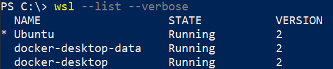
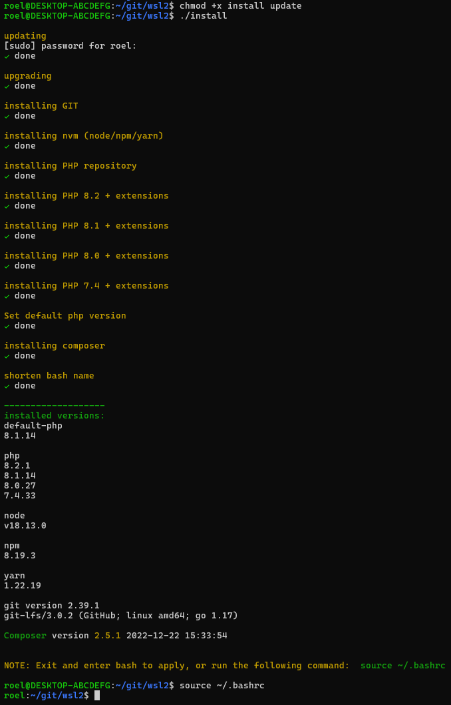
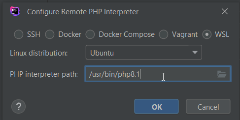
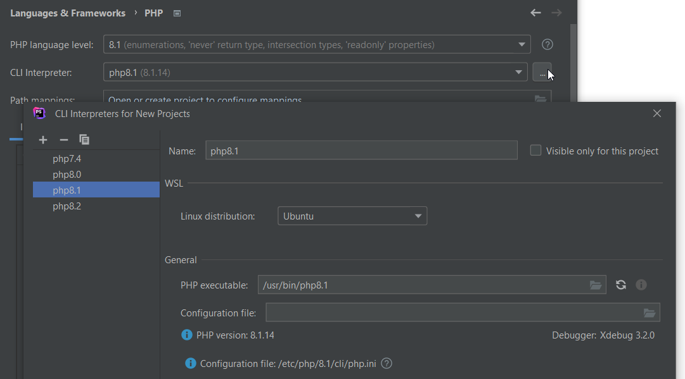

# WSL-2 Quick Setup

Following these steps will install some common tools for PHP development inside WSL2.

# Step 1: Install WSL2 + Ubuntu + Windows Terminal 'Preview' + Docker Desktop

- https://learn.microsoft.com/en-us/windows/wsl/install
- https://learn.microsoft.com/en-us/windows/terminal/install
- https://learn.microsoft.com/en-us/windows/wsl/setup/environment#set-up-windows-terminal
- https://www.docker.com/products/docker-desktop/

```ps
wsl --install

wsl --install -d Ubuntu
wsl --set-version Ubuntu 2
wsl --set-default Ubuntu
wsl --list --verbose
```

* 

 Continue by opening up Windows Terminal (set default to Ubuntu)

# Step 2: create SSH key for WSL2 machine

```bash
ssh-keygen -t ed25519 -C "laptop-work-wsl2"

# -> Keep pressing ENTER (no passphrase)

cat ~/.ssh/id_ed25519.pub
```
Copy the SSH key to your git accounts
- https://github.com/settings/keys
- https://gitlab.com/-/profile/keys


# Step 2: Setup GIT

(An older GIT version should already be installed)

```bash
git config --global user.name "My Name"
git config --global user.email "myname@example.com"
```

- https://github.com/settings/emails
- https://gitlab.com/-/profile/emails

# Step 3: clone this repo + install

```bash
mkdir -p ~/git
cd ~/git

git clone git@github.com:rboonzaijer/wsl2.git
cd wsl2

chmod +x install update
./install
```

* 

# PHPStorm on Windows - use Remote interpreter (all php versions)





# Visual Studio Code

- Download for Windows: https://code.visualstudio.com

```bash
# inside WSL-2, in any directory you want to open:
code .
```

# Update & Upgrade your Ubuntu distro (WSL2) regularly with:

```bash
cd ~/git/wsl2 && ./update
```
